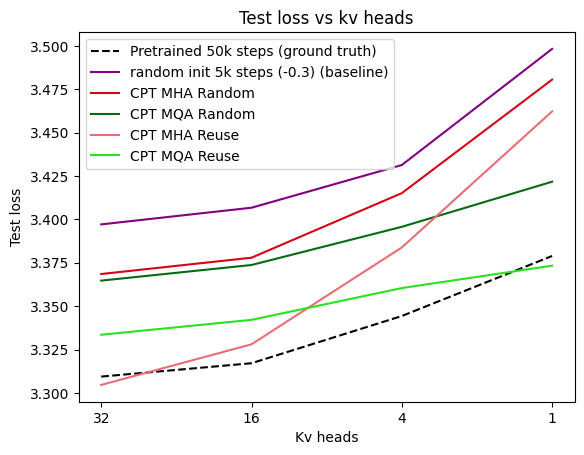
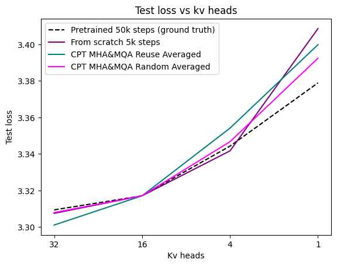
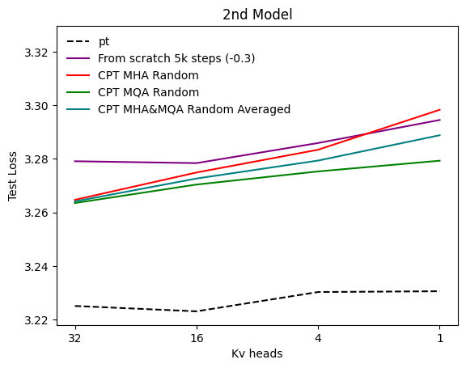
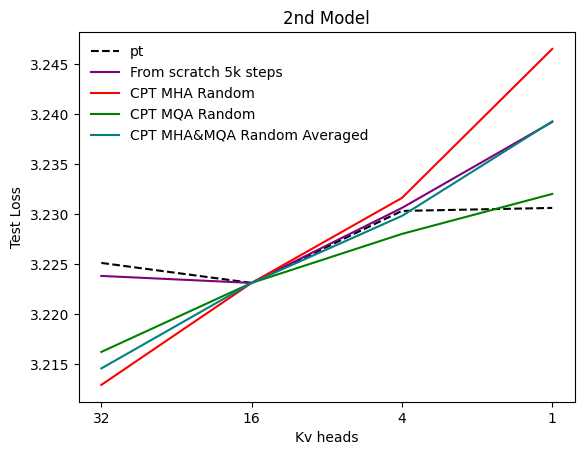

# Exploring barebones LLMs for more accurate ablations

- **TL;DR:** I attempted to reduce the compute cost of architectural ablations by training a single "Barebones" model and adapting it via Continuous Pretraining (CPT).  
- **Result:** My current experiments (predicting the performance of different qkv ratios) failed to reliably predict the performance of models trained from scratch because the models had architectural biases.  
- **Key Finding:** Adapting a MHA/MQA pre-trained model to GQA introduces strong architectural biases. A better low-cost proxy for this case was simply training a model from scratch for fewer steps (10% of total duration), which yielded higher predictive correlation than the CPT method. But I still believe that this method be effective when properly done.
---
## 1. The Concept: Barebones LLMs
Ablation studies are expensive. To find the optimal KV-head ratio or tokenizer, we typically train multiple models from scratch.  
**The Hypothesis:** Can we train a single, "unopinionated" ablation model (a Barebones LLM) and adapt it to different settings via cheap Continuous Pretraining (CPT)?
- **Example A (Tokenizers):** Train a byte-level model, then CPT it into different tokenizers.
- **Example B (Attention):** Train a standard MHA (or MQA) model, then CPT it into GQA with varying KV-head ratios.
If successful, this would allow us to run extensive experiments using a fraction of the compute.
## Experiments details:
The experiments are done on 1X0m scale, the exact parameters depends on selected kv heads, with 2 different models. The models are trained aprox. to chinchilla (3b and 3.6b, respectively). 
Here are some more details about the model training:

|              | Model 1 | Model 2 |
| ------------ | ------- | ------- |
| Head dim     | 32      | 128     |
| Q heads      | 32      | 8       |
| LR           | 5e-3    | 5e-3    |
| LR Scheduler | WSD     | WSD     |
| Optimizer    | AdamW   | AdamW   |
| # of Layers  | 12      | 18      |
| MLP dim      | 2048    | 2048    |
| Vocab Size   | 49152   | 49152   |
| Total Steps  | 50k     | 60k     |

In order to measure the predictive performance of the above mentioned method I trained a model from scratch with different q/kv ratios (while keeping the other settings the same), for the first model 32q32kv (32 query heads and 32 kv heads), 32q16kv, 32q4kv and 32q1kv, and for the second model 8q8kv, 8q4kv, 8q2kv and 8q1kv. This would work as the ground truth.

First I had to decide how to do the continuous pretraining, to find that I had to answer this questions:
- which checkpoint to start? The last one or the one just before decay?
	- After doing some not very scientific experiments I observed that which checkpoint I started did not had a very big impact. So decided to stick with the last checkpoint.
- which scheduler to select?
	- after some experiments I observed that just doing decay had the best performance test loss wise and decided to go with that.
- for how many steps to do the CPT?
	- I decided to go for 5k and 6k steps respectively, which is %10 of the pretraining (maybe for bigger runs this percentage could be smaller).
- Start from MQA or MHA?
	- I decided to to test both. 
- How to initialize the weights of the new kv heads
	- I had 2 options here (1) starting the weights randomly, same as the pretraining distribution (2) reusing the kv heads by duplicating/removing.

In order to have a baseline I also decided to train a model from scratch for 5000 and 6000 steps respectively for each model setting, same as the CPT. 

Now that we have those ready, lets see the results. 
## Model 1
Note: from the "from scratch 5k" I subtracted 0.3 to bring it to the same scale as others, because here the important thing is not the absolute values.

Lets bring all to the same scale and match it at 16kv heads while preserving the shape of the line to better understand the predictive performance. 

### Analysis:
One of the essential things for this to work is that the starting point should be unbiased, but when we look at CPT MHA Reuse (starting from mha, and removing the unnecessary heads) and CPT MQA Reuse (starting from mqa, and duplicating the kv head) we can clearly see that for both of them when the target kv heads are closer to original models kv heads the performance is better, and specially when not, the performance is much worse. And their predictive performance it not good. 
To mitigate this when we try initializing the kv heads randomly, the biases are somewhat mitigated (while still there is some) and the predictive performance is competitive maybe even better than training from randomly initialized weights for 5k steps.
To mitigate it further averaging both MQA and MHA seems to work pretty well here, **for now...**

## Model 2
Note: Here for the mqa 8q2kv run I finished it early as the results were not promising, and infered the results by looking at 8q4kv and 8q1kv.

Matched at 16kv heads:

The second model tells a whole different story, things flip upside down drastically. Here we observe that the predictive performance is not even close. And we see that the best performing one is the baseline (purple). 
## Conclusion
The results seem pretty contradictory, and it seems like this method has no predictive performance. But I missed a very important detail for it to work, **the starting point**. It should have been **unbiased**, but be it mqa or mha is not. A model pretrained with MHA/MQA is deeply optimized for that specific information flow. When we prune/duplicate heads for GQA adaptation we are breaking the model's learned internal routing. The CPT phase spends most of its compute "repairing" the damage caused by the architecture change rather than learning how that architecture performs naturally. As clearly seen from mha and mqa results, rather than being predictive we see a clear pattern: when the kv heads decrease the loss increases with a much higher slop for mha and with a smaller slop for mqa. For the first model the actual results showed the same pattern, because of that the predictive performance was very good, but for the second model this was not the case so it did not worked well over there.

I still think that this model could have some benefits when applied correctly :) Also science is science even if the results are not positive, and we need to share for others to not make the same mistake.
## Limitations
- The experiments are done on a very small scale, so take it with a grain of salt. 
